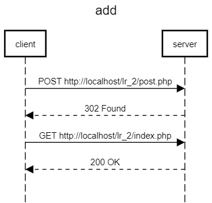

# Реализация шаблона CRUD
## Текст задания
### Цель работы
Разработать и реализовать клиент-серверную информационную систему, реализующую механизм CRUD
## Ход работы
- Пользовательский интерфейс
- Пользовательские сценарии работы
- API сервера и хореографию
- Структура базы данных
- Алгоритмы
1) [Пользовательский интерфейс](https://www.figma.com/file/JSFYDGi8EzhkEXg7aORyxq/Untitled?node-id=0%3A1&t=Rc9e4JLX1sgEuYoj-1)

2) Пользовательские сценарии работы

Пользователь попадает на страницу *index.php*. Вводит свой логин и текст поста. В случае корректного ввода данных, его сообщение появится на общей стене в обратном хронологическом порядке, вверху новые, внизу старые публикации. Пользователи могут ставить лайки на понравившиеся записи или убирать их. Также есть возможность изменить содержание записи, с помощью кнопки *change*, при нажании на которую пользователь переходит на страницу *update.php*, где вносит изменения в текст поста. Есть возможность удалять записи, с помощью кнопки *delete*.

3. API сервера и хореография\




4. Структура БД

*post*
| Название | Тип | Длина | NULL | Описание |
| :------: | :------: | :------: | :------: | :------: |
| **id** | INT | - | - | id поста |
| **login** | VARCHAR | 100 | - | Логин пользователя |
| **text** | TEXT | - | - | Текст поста |
| **date** | VARCHAR | 255 | - | Дата создания поста |
| **like** | INT | 11 | 0 | Количество лайков |

*likes*
| Название | Тип | Длина | NULL | Описание |
| :------: | :------: | :------: | :------: | :------: |
| **id** | INT | - | - | id лайка |
| **postid** | INT | - | - | id поста |

5. Алгоритмы

*Добавление записи*


*Удаление записи*


*Обновление записи*


*Реакция на запись*


6. HTTP запросы/ответы

*Запрос*

POST 
http://line/post.php
Status: HTTP/1.1 302 Found
Request Headers
Accept	
text/html,application/xhtml+xml,application/xml;q=0.9,image/avif,image/webp,image/apng,*/*;q=0.8,application/signed-exchange;v=b3;q=0.9
Content-Type	
multipart/form-data; boundary=----WebKitFormBoundaryrLqApbntyDF9f6ma
Upgrade-Insecure-Requests	
1
User-Agent	
Mozilla/5.0 (Windows NT 10.0; Win64; x64) AppleWebKit/537.36 (KHTML, like Gecko) Chrome/106.0.0.0 YaBrowser/22.11.3.818 Yowser/2.5 Safari/537.36
Response Headers
Cache-Control	
no-store, no-cache, must-revalidate
Connection	
Keep-Alive
Content-Length	
40
Content-Type	
text/html; charset=UTF-8
Date	
Sat, 17 Dec 2022 20:07:36 GMT
Expires	
Thu, 19 Nov 1981 08:52:00 GMT
Keep-Alive	
timeout=120, max=1000
Location	
../index.php
Pragma	
no-cache
Server	
Apache  

*Ответ*

GET 
http://line/index.php
Status: HTTP/1.1 200 OK
Request Headers
Accept	
text/html,application/xhtml+xml,application/xml;q=0.9,image/avif,image/webp,image/apng,*/*;q=0.8,application/signed-exchange;v=b3;q=0.9
Upgrade-Insecure-Requests	
1
User-Agent	
Mozilla/5.0 (Windows NT 10.0; Win64; x64) AppleWebKit/537.36 (KHTML, like Gecko) Chrome/106.0.0.0 YaBrowser/22.11.3.818 Yowser/2.5 Safari/537.36
Response Headers
Connection	
Keep-Alive
Content-Type	
text/html; charset=UTF-8
Date	
Sat, 17 Dec 2022 20:07:36 GMT
Keep-Alive	
timeout=120, max=999
Server	
Apache
Transfer-Encoding	
chunked

7. Значимые фрагменты кода

*Дизлайк(или уменьшение счётчика лайка)*
```php
if (isset($_POST['unliked'])) {
		$post_id = $_POST['postid'];
		$result = mysqli_query($connect, "SELECT * FROM post WHERE id = $post_id");
		$row = mysqli_fetch_array($result);
		$like = $row['likes'];
        if ($like < 0){
            $like = 0;
        }

		mysqli_query($connect, "DELETE FROM likes WHERE postid = $post_id");
		mysqli_query($connect, "UPDATE post SET likes = $like - 1 WHERE id = $post_id");

		echo $like - 1;
		exit();
	}
```

*Пагинация*
```php
$post = mysqli_query($connect, "SELECT * FROM post ORDER BY id DESC");
    $posts = mysqli_fetch_all($post);

    $total = count($posts); // кол-во постов
    $per_page = 7; // кол-во постов на одну стр
    $count_page = ceil( $total / $per_page ); // кол-во страниц
    $page = $_GET['page']??1; // определение страницы по GET
    $page = (int)$page;

    if(!$page || $page < 1){
        $page = 1;
    } else if ($page > $count_page) {
        $page = $count_page;
    }
    $start = ($page - 1) * $per_page;
```

